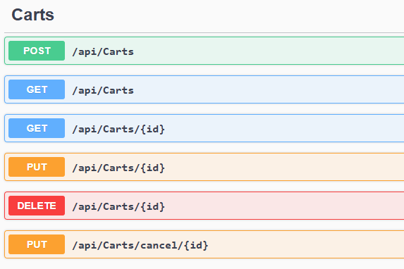
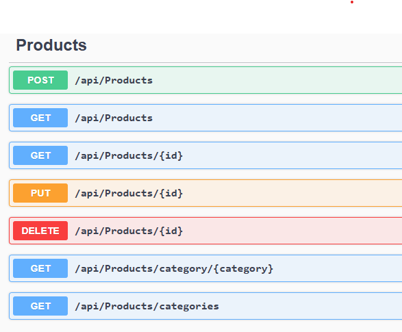

# Ambev Store API

## Description
Ambev Store API is an application to manage sales of a store.

## Prerequisites
- [.NET Core SDK](https://dotnet.microsoft.com/download) 3.1 or higher
- [Docker](https://www.docker.com/get-started) (optional, for container execution)
- [Node.js](https://nodejs.org/) (optional, for running test coverage scripts)

## Configuration

1. Clone the repository:
    ```sh
    git clone https://github.com/your-username/ambev-store-api.git
    cd ambev-store-api
    ```

2. Restore project dependencies:
    ```sh
    dotnet restore
    ```

3. Create the database and configure the connection string in the project:
    ```sh
    appsettings.json
    ```

4. Run the command in the Package Manager Console:
    ```sh
    update-database
    ```
    This will create the database structure.

## Initialization

### Run locally

1. Build the project:
    ```sh
    dotnet build
    ```

2. Run the project:
    ```sh
    dotnet run --project src/Ambev.DeveloperEvaluation.Application/Ambev.DeveloperEvaluation.Application.csproj
    ```

3. Access the Swagger documentation:
    Open your browser and go to `http://localhost:<port>/swagger`

### Run with Docker

1. Build the Docker image:
    ```sh
    docker build -t ambev-store-api .
    ```

2. Run the container:
    ```sh
    docker-compose up
    ```

3. Access the Swagger documentation:
    Open your browser and go to `http://localhost:<port>/swagger`

## Tests

1. Run the tests:
    ```sh
    dotnet test
    ```

2. Generate the test coverage report (optional):
    ```sh
    ./coverage-report.sh
    ```

3. Example of API functionality test:

    

    - Register user:
        - URL: `POST http://localhost:<port>/api/users`
        - Request body:
            ```json
            {
            "username": "user",
            "password": "c@Nn1$1T",
            "phone": "51999999999",
            "email": "p@gmail.com",
            "status": 1,
            "role": 1
            }
            ```

    

    - Register product:
        - URL: `POST http://localhost:<port>/api/products`
        - Request body:
            ```json
            {
            "title": "beer",
            "price": 2,
            "description": "ambev beer",
            "category": "drink",
            "image": "c:/temp/beer.png",
            "rating": {
                "rate": 1.2,
                "count": 15
                }
            }
            ```

    

    - Register sale:
        - URL: `POST http://localhost:<port>/api/carts`
        - Request body:
            ```json
            {
            "userId": "55dc73a6-e35f-45e3-9189-6a6ec64763f6",
            "branch": 2,
            "products": [
                    {
                    "productId": "eacafcc1-51e3-4439-86d6-59f8d297c79a",
                    "unitPrice": 13.99,
                    "quantity": 5
                    },
                    {
                    "productId": "91b1af81-8c7f-4733-aa78-92e90b4bc6dd",
                    "unitPrice": 8.99,
                    "quantity": 4
                    }
                ]
            }
            ```

    - Cancel sale:
        - URL: `DELETE http://localhost:<port>/api/sales/{id}`
        - Replace `{id}` with the ID of the sale to be canceled.

## Contribution

1. Fork the repository.
2. Create a new branch (`git checkout -b feature/new-feature`).
3. Commit your changes (`git commit -am 'Add new feature'`).
4. Push to the branch (`git push origin feature/new-feature`).
5. Open a Pull Request.

## License

This project is licensed under the MIT License. See the LICENSE file for more details.